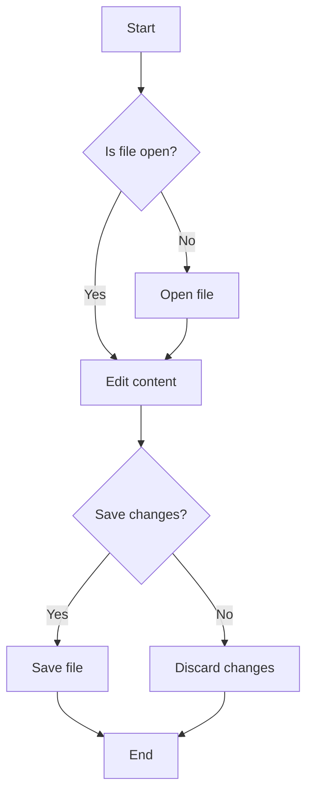
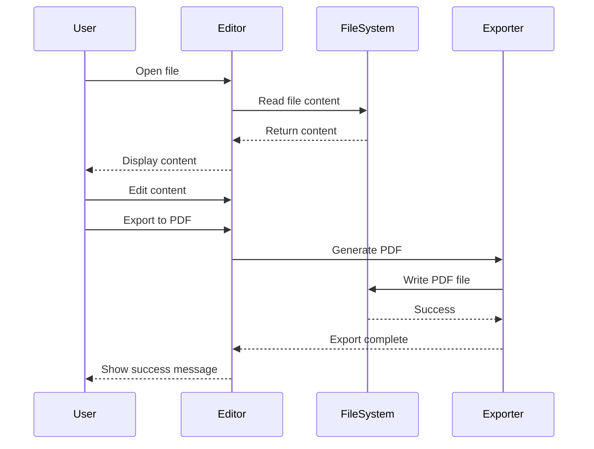
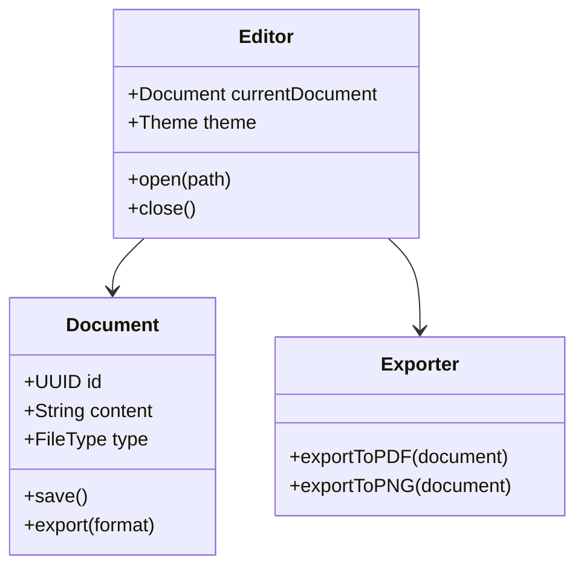

# Sample Markdown Document for QW Editor Testing

A comprehensive example demonstrating Markdown syntax highlighting with extended features.

---

## Table of Contents

1. [Introduction](#introduction)
2. [Basic Formatting](#basic-formatting)
3. [Lists](#lists)
4. [Links and Images](#links-and-images)
5. [Code Blocks](#code-blocks)
6. [Tables](#tables)
7. [Advanced Features](#advanced-features)
8. [Task Lists](#task-lists)
9. [Mathematical Expressions](#mathematical-expressions)
10. [Mermaid Diagrams](#mermaid-diagrams)

---

## Introduction

Welcome to the **QW Editor** sample Markdown document! This file showcases various Markdown syntax elements to test syntax highlighting and export features.

QW Editor is designed to be:

- **Fast** - Native performance on macOS and iOS
- **Beautiful** - Carefully crafted UI with syntax highlighting
- **Extensible** - Support for multiple file formats

> "The best editor is the one that gets out of your way and lets you focus on what matters: your content."
> 
> — QW Editor Team

---

## Basic Formatting

### Text Styles

You can use various text styles in Markdown:

- **Bold text** using double asterisks or __double underscores__
- *Italic text* using single asterisks or _single underscores_
- ***Bold and italic*** using triple asterisks
- ~~Strikethrough~~ using double tildes
- `Inline code` using backticks
- ==Highlighted text== (extended syntax)
- H~2~O for subscript (extended syntax)
- X^2^ for superscript (extended syntax)

### Headings

Markdown supports six levels of headings:

# Heading 1
## Heading 2
### Heading 3
#### Heading 4
##### Heading 5
###### Heading 6

Alternatively, you can use underlines for headings:

Heading 1
=========

Heading 2
---------

### Horizontal Rules

You can create horizontal rules using:

---

or

***

or

___

---

## Lists

### Unordered Lists

- First item
- Second item
  - Nested item 2.1
  - Nested item 2.2
    - Deeply nested item
- Third item
- Fourth item

You can also use `+` or `*`:

+ Item with plus
* Item with asterisk

### Ordered Lists

1. First item
2. Second item
   1. Nested item 2.1
   2. Nested item 2.2
3. Third item
4. Fourth item

### Definition Lists

Term 1
: Definition for term 1

Term 2
: Definition for term 2
: Alternative definition for term 2

Programming Language
: A formal language used to write instructions for computers

Syntax Highlighting
: The display of source code in different colors and fonts according to the category of terms

---

## Links and Images

### Links

There are several ways to create links:

- [Inline link](https://example.com)
- [Inline link with title](https://example.com "Example Website")
- [Reference link][ref1]
- [Link with reference ID][1]
- <https://example.com> (autolink)
- <email@example.com> (email autolink)

[ref1]: https://example.com "Reference Link"
[1]: https://github.com

### Images


[](https://example.com)

Reference style:

![QW Editor Logo][logo]

[logo]: https://via.placeholder.com/200x200 "QW Editor"

### Footnotes

Here is a statement that needs a citation[^1].

Another statement with a different source[^2].

[^1]: This is the first footnote with the citation information.

[^2]: This is the second footnote. It can contain multiple paragraphs.

    Indent paragraphs to include them in the footnote.

---

## Code Blocks

### Inline Code

Use the `print()` function to output text. The `main()` function is the entry point.

### Fenced Code Blocks

#### Python

```python
#!/usr/bin/env python3
"""Example Python module for QW Editor."""

from dataclasses import dataclass
from typing import List, Optional

@dataclass
class Task:
    """Represents a task item."""
    id: int
    title: str
    completed: bool = False
    priority: int = 0

class TaskManager:
    """Manages a collection of tasks."""
    
    def __init__(self):
        self.tasks: List[Task] = []
    
    def add_task(self, title: str, priority: int = 0) -> Task:
        """Add a new task to the manager."""
        task = Task(
            id=len(self.tasks) + 1,
            title=title,
            priority=priority
        )
        self.tasks.append(task)
        return task
    
    def complete_task(self, task_id: int) -> Optional[Task]:
        """Mark a task as completed."""
        for task in self.tasks:
            if task.id == task_id:
                task.completed = True
                return task
        return None

if __name__ == "__main__":
    manager = TaskManager()
    manager.add_task("Learn Python", priority=1)
    manager.add_task("Build an app", priority=2)
    print(f"Tasks: {manager.tasks}")
```

#### JavaScript

```javascript
// Example JavaScript module for QW Editor
class EventEmitter {
    constructor() {
        this.events = new Map();
    }
    
    on(event, listener) {
        if (!this.events.has(event)) {
            this.events.set(event, []);
        }
        this.events.get(event).push(listener);
        return () => this.off(event, listener);
    }
    
    emit(event, ...args) {
        const listeners = this.events.get(event);
        if (listeners) {
            listeners.forEach(listener => listener(...args));
        }
    }
    
    off(event, listener) {
        const listeners = this.events.get(event);
        if (listeners) {
            const index = listeners.indexOf(listener);
            if (index > -1) listeners.splice(index, 1);
        }
    }
}

export default EventEmitter;
```

#### Swift

```swift
import Foundation

struct Article: Codable, Identifiable {
    let id: UUID
    let title: String
    let content: String
    let publishedAt: Date
    
    init(title: String, content: String) {
        self.id = UUID()
        self.title = title
        self.content = content
        self.publishedAt = Date()
    }
}

@MainActor
class ArticleStore: ObservableObject {
    @Published var articles: [Article] = []
    
    func addArticle(_ article: Article) {
        articles.append(article)
    }
    
    func removeArticle(at index: Int) {
        articles.remove(at: index)
    }
}
```

#### Shell

```bash
#!/bin/bash
# Example shell script for QW Editor

set -euo pipefail

readonly SCRIPT_DIR="$(cd "$(dirname "${BASH_SOURCE[0]}")" && pwd)"
readonly OUTPUT_DIR="${SCRIPT_DIR}/output"

log() {
    echo "[$(date '+%Y-%m-%d %H:%M:%S')] $*"
}

main() {
    log "Starting export process..."
    
    mkdir -p "$OUTPUT_DIR"
    
    for file in samples/*.{py,js,swift,html,css}; do
        if [[ -f "$file" ]]; then
            log "Processing: $file"
            # Process file here
        fi
    done
    
    log "Export complete!"
}

main "$@"
```

### Indented Code Block

    This is an indented code block.
    It uses 4 spaces or 1 tab for indentation.
    No syntax highlighting is applied.
    
    function example() {
        return "Hello, World!";
    }

---

## Tables

### Basic Table

| Feature | Free | Pro | Enterprise |
|---------|:----:|:---:|:----------:|
| Syntax Highlighting | ✓ | ✓ | ✓ |
| PDF Export | — | ✓ | ✓ |
| PNG Export | — | ✓ | ✓ |
| Custom Themes | 3 | Unlimited | Custom |
| CLI Tools | — | ✓ | ✓ |
| Priority Support | — | — | ✓ |

### Complex Table

| Method | Description | Returns | Example |
|--------|-------------|---------|---------|
| `open()` | Opens a file for editing | `Document` | `editor.open("file.txt")` |
| `save()` | Saves the current document | `Bool` | `document.save()` |
| `export(format:)` | Exports to specified format | `Data?` | `document.export(.pdf)` |
| `close()` | Closes the document | `Void` | `document.close()` |

### Table with Alignment

| Left | Center | Right |
|:-----|:------:|------:|
| L1 | C1 | R1 |
| L2 | C2 | R2 |
| L3 | C3 | R3 |

---

## Advanced Features

### Blockquotes

> This is a simple blockquote.

> This is a blockquote with multiple paragraphs.
>
> The second paragraph continues the quote.
>
> > Nested blockquotes are also supported.
> > They can contain multiple levels.

> #### Blockquote with Heading
>
> - List item in blockquote
> - Another item
>
> This is *emphasized* and **bold** text in a quote.

### Abbreviations

The HTML specification is maintained by the W3C.

*[HTML]: Hypertext Markup Language
*[W3C]: World Wide Web Consortium

### Admonitions

!!! note "Important Note"
    This is an important note that draws attention to key information.
    It can span multiple lines.

!!! warning
    Be careful when using this feature.

!!! tip "Pro Tip"
    Use keyboard shortcuts for faster editing.

---

## Task Lists

### Project Tasks

- [x] Set up project structure
- [x] Implement syntax highlighting
- [x] Add PDF export
- [x] Add PNG export
- [ ] Implement line numbers in export
- [ ] Add print preview
- [ ] Create user documentation
- [ ] Write unit tests

### Sprint Goals

- [x] Phase 1: Core Features
  - [x] Text editing
  - [x] File management
  - [x] Basic syntax highlighting
- [ ] Phase 2: Export Features
  - [x] PDF export
  - [x] PNG export
  - [ ] HTML export
- [ ] Phase 3: Advanced Features
  - [ ] LSP integration
  - [ ] Git integration

---

## Mathematical Expressions

### Inline Math

The quadratic formula is $x = \frac{-b \pm \sqrt{b^2 - 4ac}}{2a}$.

Einstein's mass-energy equivalence: $E = mc^2$.

### Block Math

The Gaussian integral:

$$
\int_{-\infty}^{\infty} e^{-x^2} dx = \sqrt{\pi}
$$

Maxwell's Equations:

$$
\begin{aligned}
\nabla \cdot \mathbf{E} &= \frac{\rho}{\epsilon_0} \\
\nabla \cdot \mathbf{B} &= 0 \\
\nabla \times \mathbf{E} &= -\frac{\partial \mathbf{B}}{\partial t} \\
\nabla \times \mathbf{B} &= \mu_0 \mathbf{J} + \mu_0 \epsilon_0 \frac{\partial \mathbf{E}}{\partial t}
\end{aligned}
$$

---

## Mermaid Diagrams

### Flowchart



### Sequence Diagram



### Class Diagram



---

## Summary

This sample Markdown document demonstrates:

1. **Basic syntax** - headings, emphasis, lists
2. **Extended features** - tables, code blocks, task lists
3. **Advanced elements** - math, diagrams, admonitions

For more information, visit the [QW Editor documentation](https://github.com/muonium-ai/qw).

---

*Last updated: 2024*

**© QW Editor Team**
